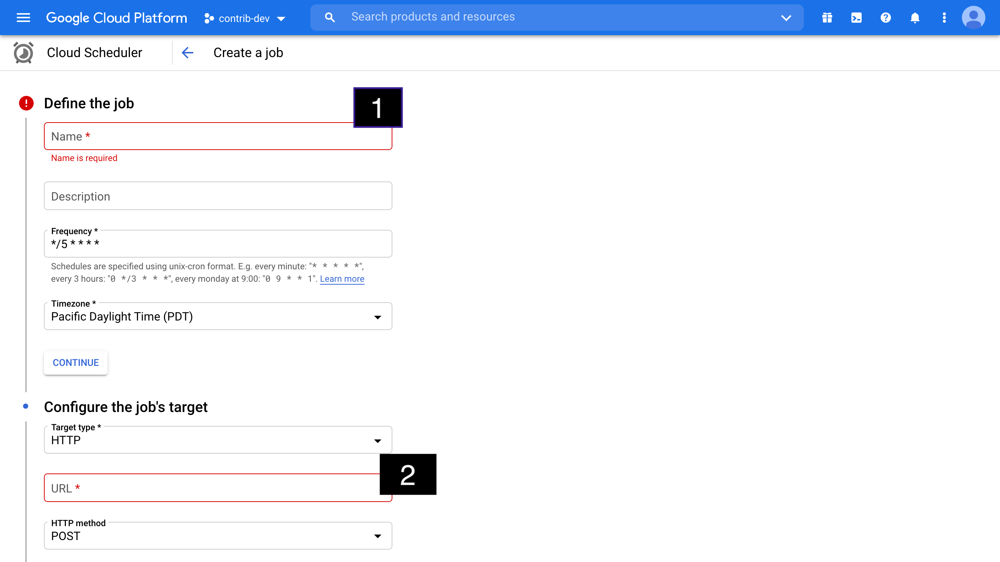
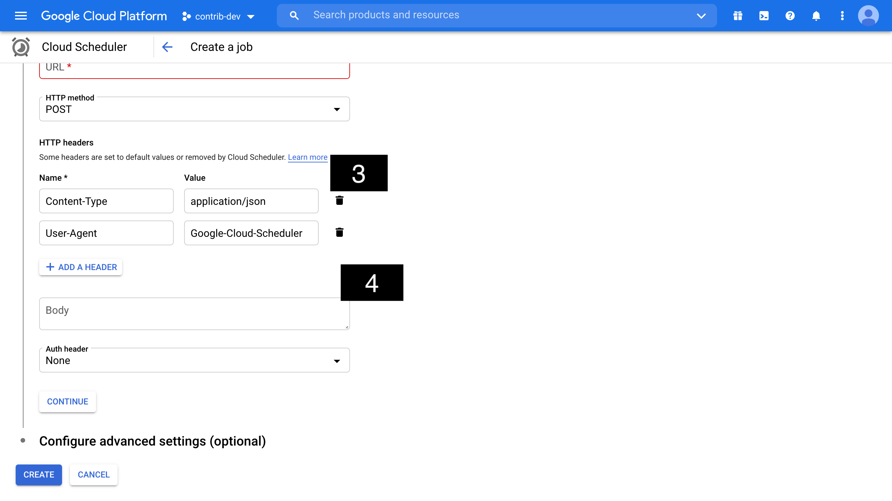

# Contrib


[](https://codecov.io/gh/contriborg/contrib-app)

## Developing locally

Yarn is used as a package manager. Therefore, npm commands are not used.

1. Install dependencies:
   -  `yarn --cwd client install`
   -  `yarn --cwd server install`
2. Get configuration properties for the backend:
   -  create `./server/.env` file with contents from 1Password
3. Start up frontend:
   -  `yarn --cwd client start`
4. Start up backend is separate tab:
   -  `yarn --cwd server start`

## Using Docker Locally

1. Install Client / Server and Create Docker Image:
   -  `yarn build`
2. Run Docker with Local `./server/.env`
   -  make sure your PORT in `./server/.env` is set to 3000
   -  `yarn docker-run`

## Technology used

-  TypeScript
-  Jest
-  MongoDB
-  React + React/DOM
-  Auth0
-  Google Cloud
-  NewRelic
-  DotEnv (Config Management)
-  Twilio (SMS & Email)

## Social support

Social sign-in support is supported for:

-  FaceBook
-  Twitter
-  Google
-  Apple

## Docker

-  Build: `docker build --rm --pull -f "./Dockerfile" -t "contrib:latest" "./"`
-  Run: `docker run --rm -d -p 3000:3000/tcp contrib:latest`

# Deploy to [dev] and [live] environments

There are two environments that we have for deployment. By default checking your source code into `main` will deploy to https://dev.contrib.org which runs out of the [us-central1] region in Google Cloud and uses the Mongo Atlas cluster [contrib-dev-cluster-1] that is also based in that region. It is deployed on Cloud Run wich will scale automatically and also goes across availability zones for the runtime and database engine (MongoDB).

The `live` environment is deployed across two regions and in each region across two availability zones. The regions are [us-west1] as primary and [us-central1] as secondary or based on geo location. The MongoDB is a Global cluster that spans across the two regions in Google Cloud named [contrib-dev-cluster-1]. To deploy to production you most create a release in Github. Once you do that it will auto deploy all code to both regions and configuration. That simple!

# Content / Object Storage

We use google cloud storage and there are two users for each environment (`dev` and `live`):

## `dev` environment:

-  url: content-dev.contrib.org
-  storage uri: content-dev.contrib.org
-  storage writer: `content-writer@contrib-dev.iam.gserviceaccount.com`
-  storage owner: `content-owner@contrib-dev.iam.gserviceaccount.com`
-  content-writer `dev`: https://start.1password.com/open/i?a=HNGEPVTM65E5PCTBJRWRVIXSJU&v=w7wdwclxmm47sjsmfjeunxxqoa&i=gg3iaanezncldb3d3yasco4n7a&h=contrib.1password.com
-  content-owner `dev`: https://start.1password.com/open/i?a=HNGEPVTM65E5PCTBJRWRVIXSJU&v=w7wdwclxmm47sjsmfjeunxxqoa&i=iatusb6hubb2pozq4qfamwecgm&h=contrib.1password.com

## `live` environment:

-  url: content.contrib.org
-  storage uri: content-live.contrib.org
-  storage writer: `content-writer@contrib-live.iam.gserviceaccount.com`
-  storage owner: `content-owner@contrib-live.iam.gserviceaccount.com`
-  content-writer `live`: https://start.1password.com/open/i?a=HNGEPVTM65E5PCTBJRWRVIXSJU&v=w7wdwclxmm47sjsmfjeunxxqoa&i=gp42f74tfzg4vhsk5ifeamkd2i&h=contrib.1password.com
-  content-owner `live`: https://start.1password.com/open/i?a=HNGEPVTM65E5PCTBJRWRVIXSJU&v=w7wdwclxmm47sjsmfjeunxxqoa&i=unlptfa6jbaixeodiwtk22vkay&h=contrib.1password.com


## configuring scheduled jobs for the auctions:

#### Configuring of the job:

- First of all go to your GoogleCloud console and seek for service called [CloudScheduler](https://console.cloud.google.com/cloudscheduler)
- Then you can add a cron job by clicking `CREATE JOB` button in the top navigation, after that you will be redirected over here:


Right now frequency for all scheduled jobs equals - `EACH 5 MINUTE`


1. First point responds to the name of the scheduled job, you can pick whatever name you prefer actually, same is for the description.
2. Second point is the URL that will be invoked: <br/>
NOTE: There are only 2 job options available for now.
   ```  
   1. Schedule job to seek the completed auctions and charge the user:
   
   DEV: https://dev.contrib.org/api/v1/auctions-settle
   LIVE: https://contrib.org/api/v1/auctions-settle
   
   2. Schedule job to seek auctions that are upcoming and enable them in the future:
   DEV: https://dev.contrib.org/api/v1/auctions-start
   LIVE: https://contrib.org/api/v1/auctions-start 
   ```



3. Please setup header like it's provided in the screenshot, since our backend application can receive exact HTTP request
4. Inside the body there should be one thing to be included:
```json
{ "key": "OUR_SECRET_KEY" }
```
NOTE: `OUR_SECRET_KEY` is located inside 1Password under `AUCTION_SCHEDULER_SECRET` variable

After that we are good to go and test out our scheduled jobs 
